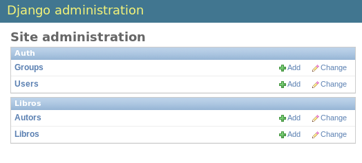

.. Taller de Python documentation master file, created by
   sphinx-quickstart on Mon Jan 27 16:38:42 2014.
   You can adapt this file completely to your liking, but it should at least
   contain the root `toctree` directive.

	
.. image:: _static/logo_posma.png
   :align: center
   
========================
Python: Django Framework
========================

.. contents:: Contenido
   :depth: 2

   
Introducción
------------

En los talleres anteriores hemos expuesto las bases de la programación en Python. Sin embargo, es nuestro objetivo
adquirir suficiente conocimiento para desarrollar proyectos de aplicación web, para ello exploraremos de manera 
práctica las herramientas que nos provee el framework *Django*.

Preparando un ambiente de desarrollo
------------------------------------

Lo primero que haremos será crear un directorio dedicado al proyecto en el que vamos a trabajar.

.. code-block:: bash

    $ mkdir mi_proyecto
    $ cd mi_proyecto

Para comenzar a implementar cualquier proyecto, bien sea éste de naturaleza web o no, es necesario preparar un
entorno de trabajo que nos provea las herramientas necesarias, facilitándonos el desarrollo de manera ordenada y sin
conflictos con otros proyectos existentes. 

Para este fin, utilizaremos *virtualenv*.

virtualenv
~~~~~~~~~~

Virtualenv es una herramienta que nos permite definir entornos aislados para cada uno de nuestros proyectos Python.
Esto es de gran utilidad, ya que hace posible que en una misma máquina convivan diversos proyectos con versiones 
distintas de python, y con un espacio aislado para cada conjunto de bibliotecas externas.

Instalación
...........

Para saber si virtualenv está ya instalado en el sistema, podemos intentar consultar su versión:

.. code-block:: bash

    $ virtualenv --version

Si no está instalado, en Debian puede hacerse de la siguiente forma:

.. code-block:: bash

    $ sudo apt-get install python-virtualenv

Una vez que está instalado, ya podemos crear un entorno virtual. Estando dentro del directorio creado anteriormente 
(``mi_proyecto``):

.. code-block:: bash

    $ virtualenv env --no-site-packages

La opción ``--no-site-packages`` significa que el nuevo entorno virtual no instalará los paquetes que se encuentran
instalados globalmente. Esto nos permite iniciar el entorno de manera limpia, e ir instalando sólo lo que sea
necesario.

Luego nos movemos al subdirectorio ``bin``, y activamos el entorno.

.. code-block:: bash

    $ cd env/bin
    $ source activate
    (env)$

Notaremos que el nombre de nuestro entorno virtual (``env``) aparece entre paréntesis al comienzo de cada línea del 
intérprete de comandos. Esto indica que nos encontramos dentro de dicho entorno. Toda biblioteca Python que instalemos 
o actualicemos sólo afectará al entorno actual, que es específico para el proyecto en el que estamos trabajando. Para 
salir del entorno, ejecutamos la instrucción ``deactivate``.

pip
~~~

Una vez que estamos "dentro" del entorno virtual deseado, podemos instalar paquetes externos de Python. Para esto 
usaremos la herramienta *pip*. 

*Pip* es un manejador de paquetes para Python, que hace posible la instalación y actualización de bibliotecas 
fácilmente desde la línea de comandos.

Para comenzar, instalaremos Django, que es el framework que vamos a utilizar.
	
.. code-block:: bash

    $ pip install django

Esto descarga e instala los paquetes necesarios para el funcionamiento del framework Django. Si queremos ver una lista 
de las bibliotecas instaladas en el entorno actual, ejecutamos:

.. code-block:: bash
	
    $ pip freeze

Si la instalación de Django se ha hecho correctamente, podemos importarlo desde el intérprete. Hagamos la siguiente 
prueba:

.. code-block:: python

    >>> import django
    >>> print(django.get_version())
    1.6

Ya estamos listos para comenzar a usar Django.
	

Django Framework
----------------

Python es un lenguaje conocido por tener "baterías incluidas", es decir, que no le hace falta nada para comenzar 
a trabajar con él. Sin embargo, existe una gran cantidad de herramientas externas y *frameworks* para el desarrollo
web. *Django* es uno de los frameworks más populares hoy en día, por ser bastante completo. Además, está 
diseñado para permitir el desarrollo de aplicaciones web de grandes dimensiones, en un tiempo relativamente corto.

¿Es Django un framework MVC?
~~~~~~~~~~~~~~~~~~~~~~~~~~~~

En Django está claramente implementada la separación entre la lógica del negocio, la naturaleza de los datos y la 
manera en la que éstos se muestran. Algunos desarrolladores afirman que el framework cumple con el patrón MVC 
(*Model-View-Controller*), sin embargo, el diseño de Django implementa un patrón un poco distinto. El framework consta
principalmente de 3 capas:
 
* Modelos (models)
* Vistas (views)
* Plantillas (templates)

En los **Modelos** se define la fuente y la estructura de los datos que la aplicación maneja. Esta capa se implementa 
en la forma de un ORM (*Object Relational Mapping*), con el cual se simplifica de manera considerable el acceso a los
datos. 

En las **Vistas**, a pesar de lo que podría pensarse, no se define la manera en que los datos son mostrados al 
usuario, sino más bien cuáles son los datos a mostrar. Ésta es la capa que se comunica con los modelos del ORM 
de Django y entrega los datos al *template*.

Las **Plantillas** definen la interfaz última entre el usuario y el sistema. Es en los *templates* en donde se define
la forma en que se muestran los datos.

Podría considerarse que lo descrito anteriormente es una implementación particular de MVC, en donde los *templates* 
representan la vista, y los *views* corresponden a los controladores. Sin embargo, esto no es técnicamente correcto,
ya que el controlador de las solicitudes realmente está implícito en el framework en sí, y en el modelo es válido 
implementar parte de la lógica del negocio.

De cualquier forma, lo importante es facilitar el desarrollo sin importar las terminologías que mejor describan el 
framework. Si es necesario asociarle un nombre, podríamos decir que Django implementa el patrón *Model-Template-View*.

Adicionalmente, Django provee las siguientes funcionalidades:

* Clases para el manejo de formularios
* Autenticación
* Interfaz adminstrativa
* Internacionalización
* Cache

... Entre otras.

Creando un nuevo proyecto
-------------------------

Para crear un proyecto en django, ejecutamos el script ``django-admin.py`` con la opción ``startproject``, de la 
siguiente manera:

.. code-block:: bash

    $ django-admin.py startproject libronline

Esto debió crear una carpeta ``libronline`` dentro de la carpeta actual, con una serie de archivos necesarios para el
funcionamiento de Django.

**Nota:** Es importante evitar el uso de nombres que puedan generar conflictos con Python o los componentes de Django.
Por ejemplo, se recomienda no utilizar palabras como "django" o "test".

Servidor de desarrollo
----------------------

Por los momentos, prestaremos particular atención al archivo ``manage.py``, el cual sirve como interfaz con diversas 
opciones para el manejo del proyecto. Por ejemplo, podemos ejecutar ``manage.py`` con la opción ``runserver`` para 
iniciar el servidor de prueba.

.. code-block:: bash

    $ manage.py runserver
    Validating models...

    0 errors found
    February 10, 2014 - 16:54:57
    Django version 1.6.2, using settings 'libronline.settings'
    Starting development server at http://127.0.0.1:8000/
    Quit the server with CTRL-C.

Esto ha iniciado un servidor de desarrollo que viene incluido dentro de Django para poder probar fácilmente, sin 
necesidad de configurar un servidor de producción, como Apache.

Ahora podemos probar ingresar el URL ``http://127.0.0.1:8000/`` en algún navegador. Esto nos mostrará una página
de bienvenida de Django, indicando que la aplicación está ejecutándose exitosamente.

Ahora, por los momentos, interrumpiremos la ejecución del servidor presionando ``CTRL-C``.

**Nota:** Es importante aclarar que el comando ``python manage.py runserver`` inicia un servidor *de prueba*. Bajo
ninguna circunstancia debe utilizarse para correr el proyecto en un ambiente de producción.

Configuración
-------------

En el archivo ``settings.py`` se encuentran definidos todos los parámetros de configuración del proyecto, como por
ejemplo las opciones de conexión a la base de datos.

Base de datos
~~~~~~~~~~~~~

Los parámetros de configuración de la base de datos los define la varible global ``DATABASES``. La configuración por 
defecto luce de esta manera:

.. code-block:: python

    DATABASES = {
        'default': {
            'ENGINE': 'django.db.backends.sqlite3',
            'NAME': os.path.join(BASE_DIR, 'db.sqlite3'),
        }
    }

Por defecto, Django utiliza *SQLite*, que es una base de datos ligera (la BD completa se almacena en un archivo). Para
utilizar algún otro manejador de base de datos, hay que cambiar el parámetro ``ENGINE``. Las opciones inicialmente 
soportadas por el framework son:

* ``'django.db.backends.postgresql_psycopg2'``
* ``'django.db.backends.mysql'``
* ``'django.db.backends.sqlite3'``
* ``'django.db.backends.oracle'``

Sin embargo, es posible implementar o instalar otros motores de conexión a base de datos.

En el parámetro ``NAME`` se especifica el nombre de la base de datos. En el caso de SQLite, esto corresponde al nombre
del archivo en disco duro, con la ruta completa en el sistema de archivos.

Si se está utilizando un motor de base de datos distinto de SQLite, es necesario definir los parámetros ``USER``, 
``PASSWORD`` y ``HOST``. Además, es necesario crear la base de datos previamente a esta configuración.

Parámetros locales
~~~~~~~~~~~~~~~~~~

Para especificar la zona horaria en la que habita nuestra aplicación, configuramos el parámetro ``TIME_ZONE``.
En el caso de Venezuela, el valor correcto es ``'America/Caracas'``.

También podemos especificar el lenguaje a utilizar en la opción ``LANGUAGE_CODE``, al cual le daremos el valor de 
``es-VE`` para el caso de Venezuela.

Iniciando la base de datos
~~~~~~~~~~~~~~~~~~~~~~~~~~

A continuación, ejecutaremos la siguiente instrucción:

.. code-block:: bash

    $ python manage.py syncdb

La instrucción ``syncdb`` crea la tablas necesarias del proyeto en la base de datos, de acuerdo a los
parámetros de configuración establecidos en el archivo ``settings.py``.

La primera vez que se ejecuta, el sistema preguntará al usuario si desea crear un usuario con permisos 
administrativos. Es recomendable hacerlo.

Una vez realizados los pasos anteriores, el proyecto está creado y debidamente configurado para iniciar su desarrollo.

Para explorar la base de datos SQLite, podemos utilizar el plugin de firefox `SQLite Manager`_, o instalar sqliteman 
usando ``apt-get``.

.. code-block:: bash

    $ apt-get install sqliteman

.. _SQLite Manager: https://addons.mozilla.org/es/firefox/addon/sqlite-manager/

Aplicaciones
------------

Un proyecto en Django consta de un conjunto de aplicaciones, éstas no son más que paquetes de Python que siguen una
convención determinada.

Para crear una aplicación, ejecutamos la instrucción ``startapp`` a través de ``manage.py``. Probaremos haciendo un 
directorio sencillo de libros:

.. code-block:: bash

    $ python manage.py startapp libros

Esto creará un directorio "libros", con la siguiente estructura:

.. code-block:: bash

    libros/
        __init__.py
        admin.py
        models.py
        tests.py
        views.py

* ``__init__.py`` indica que nuestra aplicación es un paquete válido de Python.
* En ``admin.py`` se colocará el código referente al administrador de Django para la aplicación actual.
* En ``models.py`` se escribirá todo el código de los modelos.
* ``tests.py`` funciona para pruebas unitarias.
* Y en ``views.py`` se implementarán las vistas propias de la aplicación ``libros``

     
Modelos
-------

Lo primero que haremos con nuestra aplicación será definir los modelos. Para esto editaremos el archivo ``models.py``
y crearemos dos clases: ``Autor`` y ``Libro``

.. code-block:: python

    # -*- coding: utf-8 -*-
    from django.db import models

    class Autor(models.Model):
        nombre = models.CharField(max_length=200)

        def __unicode__(self):
            return self.nombre

    class Libro(models.Model):  
        GENERO_CHOICES = (
            (1, 'Novela'),
            (2, 'Crónica'),
            (3, 'Ensayo'),
            (4, 'Académico'),
            (5, 'Biografía')
        )
        
        titulo = models.CharField(max_length=200)
        fecha_pub = models.DateField()
        autor = models.ForeignKey(Autor)
        genero = models.IntegerField(choices=GENERO_CHOICES, default=1)
        
        def __unicode__(self):
            return "%s - %s" % (self.titulo, self.autor.nombre)

Cada modelo se define como una clase que hereda de ``django.db.models.Model``, definiendo a su vez una serie de 
atributos de clase. Cada uno de estos atributos representa un campo en la base de datos.

Cada campo es una instancia de la clase ``django.db.models.Field``, cuyas subclases implementan los distintos tipos
de datos. En el ejemplo podemos ver el uso de ``CharField`` para cadenas de texto, ``IntegerField`` para números 
enteros, ``DateField`` para fechas, y ``ForeignKey`` para relaciones directas con otros modelos.

Un ``ForeignKey`` puede verse como una relación "uno a muchos", ya que distintos modelos pueden definir la misma 
*llave foránea* con un modelo dado. Un autor puede escribir muchos libros, pero un libro sólo pertenece a un autor.

Se han implementado además los métodos ``__unicode__`` de cada modelo, estos definen la representación textual de las 
instancias particulares de cada clase. Si queremos hacer ``print`` de un objeto de la clase ``Libro``, veremos su 
título y autor, en lugar de ``<Libro object at 0x328F10A1>``.

El siguiente paso es agregar nuestra aplicación ``libros`` a la lista de aplicaciones intaladas en el 
``settings.py``.

.. code-block:: python

    INSTALLED_APPS = (
        'django.contrib.admin',
        'django.contrib.auth',
        'django.contrib.contenttypes',
        'django.contrib.sessions',
        'django.contrib.messages',
        'django.contrib.staticfiles',

        'libros',
    )

Ahora necesitamos sincronizar la base de datos con la instrucción ``syncdb``, para que Django cree las tablas y los
campos correspondientes a nuestro modelo.

.. code-block:: bash

    $ python manage.py syncdb

Es necesario ejecutar esta instrucción cada vez que hacemos cambios en el modelo, ``syncdb`` sólo hará los cambios
necesarios en la base de datos.

El administrador de Django
--------------------------

Una de las características principales de Django es que viene con una interfaz administrativa que facilita mucho el 
trabajo. A través de esta interfaz podemos manejar todas las entidades en el sistema. Una vez creados los modelos, ya 
podemos consultar, insertar, editar y eliminar objetos; sin necesidad de implementar interfaces adicionales.

Para habilitar un modelo en la interfaz administrativa, editamos el archivo ``libros/admin.py`` y colocamos el 
siguiente código:

.. code-block:: python

    from django.contrib import admin
    from libros.models import Libro, Autor

    admin.site.register(Libro)
    admin.site.register(Autor)

A continuación, ejecutamos el servidor de prueba con ``python manage.py runserver`` y abrimos el navegador con el URL 
``http://127.0.0.1:8000/admin/``. Para ingresar al sistema, usaremos el super-usuario que hemos creado al comienzo. 
Entonces veremos una interfaz similar a ésta:

Podemos consultar la lista de objetos de cada uno de los modelos haciendo click en su sección correspondiente. 
Evidentemente no hay objetos creados aún, añadiremos primero un autor haciendo click en su sección ``Autores`` y 
luego en el botón de la esquina ``Añadir autor``.

Seguidamente introducimos el nombre del autor y hacemos click en ``Grabar``. Ahora podemos ver el nuevo autor en el 
listado:

    
Ahora añadiremos un libro...

Como podemos ver, es bastante sencillo manipular los objetos del sistema a través del administrador de django, 
habiendo definido únicamente los modelos.

Podemos notar que Django ha intentado inferir automáticamente el plural de ``Autor``, y ha colocado ``Autors`` en su 
lugar, lo cual no es correcto. Para especificar este tipo de detalles, se define en Django una clase interna llamada 
``Meta`` dentro del modelo en cuestión:

.. code-block:: python

    class Autor(models.Model):
        class Meta:
            verbose_name_plural = "Autores"
        # ...

Django desde el intérprete interactivo
--------------------------------------

Es posible tener acceso a nuestro proyecto Django desde el intérprete interactivo de Python. Para esto ejecutamos la 
siguiente instrucción en la raíz del proyecto:

.. code-block:: bash

    $ python manage.py shell

Esto abre el intérprete interactivo habiendo cargado todos los parámetros de. ``settings.py``, por lo cual tendremos 
acceso a los modelos que hemos creado. Usaremos el intérprete interactivo para jugar un poco con el API de Django.

.. code-block:: python

    >>> from libros.models import Autor, Libro
    >>> Autor.objects.all()
    [<Autor: Herman Hesse>, <Autor: Paulo Coelho>]

Esto nos muestra un poco cómo funciona el ORM de Django. A nivel de código simplemente estamos tratando con objetos, 
el framework se encarga de interactuar directamente con la base de datos.

Podemos acceder a los campos de los registros simplemente mediante los atributos de cada objeto:

.. code-block:: python

    >>> herman = Autor.objects.all()[0]
    >>> herman.nombre
    u'Herman Hesse'

La ``u`` antes de la cadena indica que se está trabajando con una cadena "unicode". Esto permite que las cadenas 
contengan caracteres especiales.

Además de consultar, es posible utilizar el API completo de los modelos de Django. También podemos crear nuevos 
objetos y guardarlos en la base de datos:

.. code-block:: python

    >>> serafin = Autor(nombre="Serafin Mazparrote")
    >>> serafin.save()
    >>> lb = Libro(titulo=u"Biología de 8º grado", fecha_pub="1990-01-01", autor=serafin)
    >>> lb.save()
    >>> lb2 = Libro(titulo="Siddhartha", fecha_pub="1922-01-01", autor=herman)
    >>> lb2.save()

        
Hay distintas maneras de consultar objetos relacionados a través del API. Una de ellas es mediante el atributo 
``libro_set`` el objeto de tipo ``Autor``, éste tiene acceso a una lista con todos los libros relacionados, a pesar 
de que la llave foránea se encuentra definida en el modelo ``Libro``. 

.. code-block:: python

    >>> herman.libro_set.objects.all()
    [<Libro: Demian - Herman Hesse>, <Libro: Siddhartha - Herman Hesse>]

Además de obtener todos los objetos, es posible filtrar resultados mediante el método ``filter``:

.. code-block:: python

    >>> Libro.objects.filter(autor=herman)
    [<Libro: Demian - Herman Hesse>, <Libro: Siddhartha - Herman Hesse>]

.. incluir info de todos los filtros en django
    
Con el método ``get`` obtenemos un único resultado, esto es útil para buscar por id. Si buscamos un objeto con un id 
que no existe, esto levantará una excepción. La llave primaria de un modelo no se llama necesariamente ``id``, así 
que podemos utilizar el parámetro ``pk`` al momento de buscar:

.. code-block:: python

    >>> Libro.objects.get(id=50)
    Traceback (most recent call last):
        ...
    DoesNotExist: Libro matching query does not exist. Lookup parameters were {'id': 50}   
    >>> L = Libro.objects.get(pk=1)
    >>> L.titulo
    'Demian'

Otra función útil de búsqueda es ``exclude``:

.. code-block:: python

    >>> Autor.objects.all()
    [<Autor: Herman Hesse>, <Autor: Paulo Coelho>, <Autor: Serafin Mazparrote>]
    >>> Autor.objects.exclude(nombre__contains="Paulo")
    [<Autor: Herman Hesse>, <Autor: Serafin Mazparrote>]

Podemos notar que en el ejemplo anterior se ha utilizado un parámetro de búsqueda que no hemos visto antes: 
``nombre__contains``. Es posible hacer búsquedas de bastante complejidad utilizando el API de los modelos de Django. 
Lo ideal es que el programador no tenga que recurrir a hacer *queries* directos a la base de datos. 

A continuación describiremos de manera más detallada los métodos y parámetros de búsqueda de la clase ``QuerySet``.

QuerySets
---------

En los ejemplos anteriores hemos experimentado con resultados de búsquedas sobre modelos. Para entender de manera más 
completa este mecanismo, es necesario explicar la clase ``QuerySet``.

Cada vez que efectuamos una instrucción como ``Autor.objects.all()`` estamos lidiando con un *QuerySet*. Un QuerySet 
representa una consulta a la base de datos, sin embargo, es importante destacar que estas expresiones no son 
evaluadas hasta que el código las utilice, como por ejemplo, en el recorrido de un ciclo:

.. code-block:: python

    for a in Autor.objects.all():
        print a

Para saber cuántos resultados nos devuelve un QuerySet, por ejemplo, podríamos hacer:

.. code-block:: python

    len(Autor.objects.all())

Sin embargo, esto ejecutará la consulta completa a la base de datos, la convertirá en una lista y entonces aplicará 
la función ``len()``. En lugar de esto, la clase ``QuerySet`` nos provee el método ``count``:

.. code-block:: python

    >>> Autor.objects.all().count()
    3

El uso de ``count()`` se traduce internamente como una consulta en SQL que utiliza ``SELECT COUNT(*)``, lo cual es 
mucho más eficiente.

De igual manera podemos utilizar *slicing* en los objetos de búsqueda:

.. code-block:: python

    >>> AlgunModelo.objects.all()[:50]
    
Esto retornará otro ``QuerySet`` sin ejecutar, lo cual es más eficiente que ejecutar la consulta y luego obtener los 
primeros 50 registros.

También es posible encadenar los métodos descritos en esta sección:

.. code-block:: python

    >>> Libro.objects.filter(autor__nombre__contains="Herman").exclude(titulo="Demian").count()
    1

Métodos de QuerySet
~~~~~~~~~~~~~~~~~~~

Además de ``all()``, ``get()``, ``filter()`` y ``exclude()``, la clase ``QuerySet`` soporta los siguientes métodos:

order_by
........

.. code-block:: python

    >>> Libro.objects.all().order_by('autor')
    [<Libro: Demian - Herman Hesse>, <Libro: Siddhartha - Herman Hesse>, <Libro: Biología de 8º grado - Serafin 
    Mazparrote>]
    >>> Libro.objects.all().order_by('-autor')  # indica el orden inverso
    [<Libro: Biología de 8º grado - Serafin Mazparrote>, <Libro: Siddhartha - Herman Hesse>, <Libro: Demian - Herman 
    Hesse>]

reverse
.......

.. code-block:: python

    >>> AlgunModelo.objects.all().reverse()     # retorna la lista inversa

distinct
........

Retorna un QuerySet que utiliza la cláusula ``SELECT DISTINCT`` en SQL. Esto elimina las filas duplicadas en el 
resultado.

.. code-block:: python

    >>> mi_queryset.all()
    >>> mi_queryset.distinct()

values
......

El uso de ``values()`` nos retorna, diccionario con los resultados en lugar de objetos:

.. code-block:: python

    >>> Libro.objects.values()
    [{'titulo': u'Demian', 'genero': 1, u'id': 1, 'fecha_pub': datetime.date(1919, 2, 13), 'autor_id': 1}, {'titulo': 
    u'Biolog\xeda de 8\xba grado', 'genero': 1, u'id': 2, 'fecha_pub': datetime.date(1990, 1, 1), 'autor_id': 3}, 
    {'titulo': u'Siddhartha', 'genero': 1, u'id': 3, 'fecha_pub': datetime.date(1922, 1, 1), 'autor_id': 1}]

first
.....

Nos retorna el primer elemento en la consulta:

.. code-block:: python

    >>> Libro.objects.first()
    <Libro: Demian - Herman Hesse>

En el caso de no existir, ``first()`` nos retorna ``None``:

.. code-block:: python

    >>> a = Autor.objects.filter(nombre__contains="Hemmingway").first()
    >>> a is None
    True

last
....

De igual manera que ``first()``, pero esta vez nos retorna el último elemento de la consulta.

.. code-block:: python

    >>> Autor.objects.last()
    <Autor: Serafin Mazparrote>
    

exists
......

Retorna ``True`` si existe un registro que cumple con los parámetros de búsqueda dados:

.. code-block:: python

    >>> Autor.objects.filter(nombre__contains="Neruda").exists()
    False

create
......

Éste es un método que nos permite crear objetos sin tener que instanciar e invocar a ``save()``.

.. code-block:: python

    >>> coelho = Autor.objects.get(nombre__contains="Coelho")
    >>> coelho.libro_set.create(titulo="El Alquimista", fecha_pub="1990-01-01")
    <Libro: El Alquimista - Paulo Coelho>
    >>> coelho.libro_set.create(titulo="Once minutos", fecha_pub="1990-01-01")
    <Libro: Once minutos - Paulo Coelho>

update
......

``update`` permite hacer actualizaciones directas en el QuerySet, sin tener que  obtener, modificar y luego invocar a 
``save()``:

.. code-block:: python

    >>> Libro.objects.filter(titulo__contains="Alquimista").update(fecha_pub="1990-01-01")
    1
    
La instrucción nos retorna ``1``, indicando que 1 registro fue actualizado exitosamente.

delete
......

El método ``delete()`` nos permite eliminar todos los registros existentes en un QuerySet:

.. code-block::

    >>> Libro.objects.filter(autor=coelho).delete()
    >>> Libro.objects.filter(autor=coelho).exists()
    False

Parámetros de consulta
~~~~~~~~~~~~~~~~~~~~~~

Para el uso de ``get()``, ``filter()`` y ``exclude()``, además de la igualdad exacta, se definen varios parámetros de 
búsqueda. Estos parámetros se concatenan con los atributos de búsqueda mediante doble *underscore* (``__``):

contains
........

.. code-block:: python

    >>> Autor.objects.filter(nombre__contains="Serafin")
    [<Autor: Serafin Mazparrote>]

icontains
.........

Funciona igual que ``contains``, pero no distingue mayúsculas o minúsculas:

.. code-block:: python

    >>> Autor.objects.filter(nombre_icontains="serafin")
    [<Autor: Serafin Mazparrote>]

in
..

Se utiliza para preguntar si el valor de un atributo específico se encuentra dentro de alguna colección:

.. code-block:: python

    >>> Libro.objects.filter(id__in=[1,2])
    [<Libro: Demian - Herman Hesse>, <Libro: Biología de 8º grado - Serafin Mazparrote>]

gt, gte, lt, lte
................

Para hacer comparaciones de desigualdad, se utilizan las siguientes palabras: 

* ``gt`` (mayor que)
* ``gte`` (mayor o igual)
* ``lt`` (menor que)
* ``lte`` (menor o igual)

.. code-block:: python

    >>> Libro.objects.filter(fecha_pub__lte="1980-01-01")
    [<Libro: Demian - Herman Hesse>, <Libro: Siddhartha - Herman Hesse>]

range
.....

Se utiliza ``range`` para especificar atributos cuyos valores se encuentren dentro de algún rango, es bastante útil 
para las fechas:

.. code-block:: python

    >>> import datetime
    >>> start_date = datetime.date(1920, 1, 1)
    >>> end_date = datetime.date(2013, 3, 31)
    >>> Libro.objects.filter(fecha_pub__range=(start_date, end_date))
    [<Libro: Biología de 8º grado - Serafin Mazparrote>, <Libro: Siddhartha - Herman Hesse>]

year, month, day
................

Se utiliza para discriminar partes específicas de atributos de tipo fecha:

.. code-block:: python

    >>> Libro.objects.filter(fecha_pub__year="1990")
    [<Libro: Biología de 8º grado - Serafin Mazparrote>]
    
De igual manera funciona para ``month`` en el caso de querer especificar un mes en particular, y ``day`` para un día 
específico del mes.

isnull
......

Para preguntar si un valor es nulo, se utiliza el parámetro ``isnull``, de la siguiente manera:

.. code-block:: python

    >>> Libro.objects.filter(fecha_pub__isnull=True)
    []

Vistas
------

Hasta ahora hemos estudiado el comportamiento de los modelos de Django, junto con dos maneras de interactuar con 
éstos: el intérprete interactivo y la interfaz administrativa. Sin embargo, para desarrollar cualquier proyecto 
necesitaremos implementar nuestras propias vistas.

Para comenzar a entender las vistas, implementaremos primero un "hola mundo". Para esto editaremos el archivo 
``views.py`` que está dentro de la aplicación ``libros`` y copiaremos el siguiente código:

.. code-block:: python

    from django.http import HttpResponse

    def index(request):
        return HttpResponse("Hola mundo!")

Ésta es la manera más básica de definir una vista en Django: una función que recibe un objeto de tipo ``HttpRequest`` 
y retorna un ``HttpResponse``. Para fines prácticos sólo estaremos retornando un mensaje con la expresión "Hola 
mundo!".

Mapeo de URLs
~~~~~~~~~~~~~

Ahora necesitamos crear dentro del directorio de la aplicación (``libros``), un archivo ``urls.py`` para definir una  
correspondencia entre un URL y la vista que acabamos de definir. Copiaremos entonces el siguiente código:
 
.. code-block:: python

    from django.conf.urls import patterns, url
    from libros import views

    urlpatterns = patterns('',
        url(r'^$', views.index, name='index')
    )

``'^$'`` es una expresión regular que equivale a una cadena vacía, y corresponde con la raíz de la aplicación actual 
(``libros``).

Ahora necesitamos editar el archivo ``urls.py`` que se encuentra en el directorio principal de proyecto 
(``libronline/libronline/``), para dar acceso al módulo ``libros``. El código debería quedar así:

.. code-block:: python

    from django.conf.urls import patterns, include, url

    from django.contrib import admin
    admin.autodiscover()

    urlpatterns = patterns('',
        url(r'^libros/', include('libros.urls')),
        url(r'^admin/', include(admin.site.urls)),
    )

De esta forma hemos configurado nuestro sitio para que todo URL que comience con ``libros/`` se redirija al módulo 
correspondiente.

Guardamos entonces el archivo y ahora podemos probar iniciando nuevamente el servidor con ``python manage.py 
runserver`` e introduciendo ``http://127.0.0.1:8000/libros/`` en el navegador. Si hemos hecho todo correctamente, 
deberíamos ver una página con el mensaje "Hola mundo!".

En los archivos de ``urls.py`` se definen *expresiones regulares* que describen los patrones de URL que se asociarán 
a determinadas vistas, o a los archivos de "mapeo" de URLs de aplicaciones específicas. De esta forma se pueden 
mantener organizadas de manera modular todas las rutas de las vistas del proyecto.

Para mayor información sobre la sintaxis de expresiones regulares, referirse a la documentación_ oficial del módulo 
``re`` de Python.

.. _documentación: http://docs.python.org/2/howto/regex.html

Ahora cambiaremos ``libros.views.index`` para convertirla en una vista que realmente haga algo: ésta ahora mostrará 
una lista de "Autores destacados" (sólo aquellos que han escrito algún libro), y haremos otra que dé un poco más de 
detalle sobre cada autor.

Copiemos el siguiente código en el archivo ``views.py``

.. code-block:: python

    from django.shortcuts import render

    from libros.models import Autor, Libro

    def index(request):
        autores = Autor.objects.exclude(libro__isnull=True)
        context = {'autores_list': autores}
        return render(request, 'libros/index.html', context)

    def autor_detail(request, autor_id):
        try:
            autor = Autor.objects.get(pk=autor_id)
        except Autor.DoesNotExist:
            raise Http404
        return render(request, 'libros/autor_detail.html', {'autor': autor})

Ahora debemos definir el mapeo de URLs para acceder a la vista de detalle de autor. Nuestro archivo 
``libros/urls.py`` debería lucir de esta forma:

.. code-block:: python

    from django.conf.urls import patterns, url
    from libros import views

    urlpatterns = patterns('',
        url(r'^$', views.index, name='index'),
        url(r'^autor/(?P<autor_id>\d+)/$', views.autor_detail, name='autor_detail')
    ) 

La expresión ``(?P<autor_id>\d+)`` simplemente corresponde a una serie de dígitos numéricos, y asigna el valor 
encontrado a un argumento con el nombre "autor_id", el cual será recibido por la vista. Esto permitirá URLs de esta 
forma, por ejemplo: ``/libros/autor/5/``. Redirigiendo entonces a la vista ``autor_detail`` que hemos creado, y 
pasando el id del autor como argumento.

Plantillas
----------

Como podemos notar, esta vez nuestras vistas redirigen a unos *templates* (``index.html`` y ``autor_detail``) que aún 
no existen. Vamos a crear estas plantillas, y a configurar todo lo necesario para que funcionen.

Lo primero que haremos será crear una carpeta ``templates`` que se encuentre en la raíz del proyecto (en el mismo 
directorio en donde se encuentra ``manage.py``). Dentro crearemos otra carpeta con el nombre de la aplicación 
(``libros``):

.. code-block:: bash

    $ mkdir templates
    $ cd templates
    $ mkdir libros

Ahora crearemos ``index.html``, con el siguiente código:

.. code-block:: django

    <h1>Autores destacados</h1>
    
        <ul>
        
            <li><a href="/libros/autor/{{ autor.id }}/">{{ autor.nombre }}</a></li>
        
        </ul>
    
        
No hay autores definidos en el sistema.

    

Como podemos observar, estas plantillas tienen una sintaxis particular. Se trata de html común, con una serie de 
etiquetas propias de Django. Para fines prácticos y por el bien de la legibilidad, por los momentos no es necesario 
definir toda la estructura del archivo html, el navegador es capaz de interpretarlo. Al momento de realizar proyectos 
reales, sin embargo, se recomienda escribir código html completo.

Ahora crearemos un archivo ``autor_detail.html`` en el mismo directorio, con el siguiente código:

.. code-block:: django

    <h1>{{ autor.nombre }}</h1>

    Obras escritas:
    <ul>
    
        <li>{{ libro.titulo }} ({{ libro.fecha_pub|date:"Y" }})</li>
    
    </ul>

    <a href="/libros/">Volver al inicio</a>

Configuración
~~~~~~~~~~~~~

Es necesario hacer algunos ajustes para que Django encuentre nuestras plantillas. Abramos el archivo ``settings.py`` 
e insertemos al final los parámetros ``TEMPLATE_LOADERS`` y ``TEMPLATE_DIRS`` con los siguientes valores:

.. code-block:: python

    TEMPLATE_LOADERS =(
    'django.template.loaders.filesystem.Loader',
    'django.template.loaders.app_directories.Loader'
    )

    TEMPLATE_DIRS = (
        os.path.join(BASE_DIR, 'templates'),
    )

Probando todo junto
-------------------

Si hemos hecho todo bien hasta ahora, deberíamos poder probar nuestro sitio a través de la URL 
``http://127.0.0.1:8000/libros/``. Hagámoslo!

Referencias útiles
------------------

* http://www.djangoproject.com (sitio oficial)
* http://lightbird.net/dbe/index.html (tutorial con ejemplos)
* http://effectivedjango.com/ (guía avanzada)

